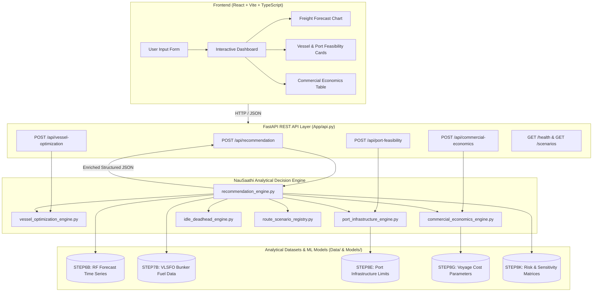

# NauSaathi — Intelligent Freight Forecasting & Vessel Chartering Decision Support

> **Turning maritime market data into explainable freight, vessel, and chartering decisions.**

[](https://www.python.org/)
[](https://fastapi.tiangolo.com/)
[](https://react.dev/)
[](https://www.typescriptlang.org/)
[](https://vitejs.dev/)
[](https://tailwindcss.com/)

---

## 1. Title
**NauSaathi — Intelligent Freight Forecasting & Vessel Chartering Decision Support**

* **Problem Statement:** Development of an Intelligent Freight Forecasting Model for Optimized Vessel Chartering and Bulk Cargo Procurement from overseas to East Coast of India.
* **Problem ID:** SIH26006
* **Theme:** Transportation & Logistics
* **Category:** Software

---

## 2. Tagline
> **Turning maritime market data into explainable freight, vessel, and chartering decisions.**

---

## 3. Project Overview
NauSaathi is an engineering and commercial decision-support system built for Indian dry bulk importers, procurement teams, and chartering desks. Focusing on long-haul raw material procurement (e.g., coking coal) moving from overseas export hubs to India's East Coast ports, NauSaathi:

* **Forecasts Freight Rates:** Projects forward freight price curves and benchmark market indices across forward horizons.
* **Evaluates Vessel Suitability:** Screens vessel size classes against parcel volume, hold capacities, and deadweight limits.
* **Checks Port & Route Feasibility:** Validates draft, length overall (LOA), and beam limits at both load and discharge berths.
* **Evaluates Chartering Timing:** Analyzes market trajectory and rate volatility across 30, 60, and 90-day procurement windows.
* **Combines Multi-Layer Analytics:** Synthesizes bunker prices, deadhead distances, idle risks, and voyage economics.
* **Produces Explainable Recommendations:** Delivers auditable, transparent operational strategies rather than opaque black-box scores.
* **Targets India's East Coast:** Built specifically for major bulk terminals including Dhamra, Paradip, Gangavaram, Visakhapatnam, Gopalpur, and Haldia.

---

## 4. Problem We Solve
Maritime bulk procurement for steel plants, thermal power stations, and heavy industries on India's eastern seaboard faces compounding operational and commercial challenges:

* **Freight Volatility:** Bulk dry indices (Baltic Dry Index, BPI, BCI) experience sharp cyclical swings influenced by global commodity demand, fleet availability, and bunker fuel fluctuations.
* **Complex Vessel Selection:** Selecting an improper vessel class leads to severe cargo dead-freight penalties or demurrage.
* **Port & Infrastructure Constraints:** Several East Coast Indian ports face shallow draft bars, berth length limitations, or lack mechanized high-capacity unloaders.
* **Charter Timing Uncertainty:** Procurement officers often struggle to decide whether to fix spot voyages immediately, defer negotiations, or secure forward period charters.
* **Operational & Repositioning Risk:** Inadequate voyage turnaround planning results in costly deadhead ballast legs and vessel idle periods.
* **Fragmented Decision-Making:** Freight market indices, port marine manuals, and voyage estimates are typically kept in disconnected silos, making rapid end-to-end evaluation difficult.

---

## 5. NauSaathi Solution
NauSaathi unifies market intelligence, physical naval architecture parameters, port hydrographic limits, and voyage cost structures into a single cohesive decision flow:

```
[User Input] (Cargo, Volume, Origin, Destination, Window)
      │
      ▼
[FastAPI Backend Engine]
      │
      ├── [Machine Learning Forecasting] ─── Random Forest Model + Forward Horizon Curves
      ├── [Vessel Optimization Engine]   ─── DWT, Parcel Fit, LOA/Beam/Draft Compatibility
      ├── [Port Infrastructure Engine]   ─── Berth Draft, Direct Discharge vs. Lighterage
      ├── [Commercial Economics Engine]  ─── Bunker Costs, Partial Break-Even & Voyage Run
      ├── [Idle & Deadhead Engine]       ─── Post-Discharge Repositioning & Ballast Risk
      └── [Charter Strategy Engine]      ─── Contracting Window & Rate Horizon Evaluation
      │
      ▼
[Explainable Final Recommendation] (Action Signal, Primary Vessel, Route Feasibility, Risk Level)
      │
      ▼
[Interactive Web Application] (React + TypeScript + Dynamic Dashboards)
```

---

## 6. Key Capabilities

### Implemented Capabilities
* **Freight Price Forecasting:** Dynamic forward freight projections derived from historical index movements and machine learning forecasts.
* **Multi-Class Vessel Screening:** Automated screening across Handysize, Supramax, Panamax, and Capesize classes against cargo parcel requirements.
* **Dual-Port Physical Feasibility:** Rule-based engineering validation checking draft, length overall (LOA), and beam limits at load and discharge ports.
* **Alternative Discharge & Lighterage Routing:** Automatic detection when deep-draft vessels exceed port limits, suggesting offshore lighterage or transshipment anchorages.
* **Chartering Window Analysis:** Structured market entry timing evaluated over 30-day, 60-day, and 90-day forward horizons.
* **Voyage & Bunker Cost Economics:** Partial voyage cost calculations factoring daily fuel consumption at sea and in port using verified bunker fuel price benchmarks.
* **Idle & Deadhead Analysis:** Assessment of post-discharge repositioning legs and deadweight ballast exposure for vessels discharging on the Indian East Coast.
* **Risk & Sensitivity Matrix:** Evaluation of market exposure, draft safety margins, and freight rate sensitivity under fluctuating market regimes.
* **Explainable Recommendations:** Transparent multi-criteria scoring breakdowns providing clear justifications for vessel choice and charter actions.

### Planned Enhancements (Future Roadmap)
* **Automated Demurrage & Detention Calculator:** *Planned enhancement.* Fine-grained laytime, notice of readiness (NOR), and weather working day (WWD) demurrage tracking is slated for future release and is not part of the current core calculation engine.
* **Live Automated AIS Vessel Tracking:** *Planned enhancement.* Real-time satellite AIS vessel positioning for candidate fleets.

---

## 7. Machine Learning

* **Primary Model:** **Random Forest Regressor** is the final selected machine learning model used to generate multi-month forward freight index forecasts (Panamax BPI and Capesize BCI). Random Forest was chosen for its robustness against non-linear regime shifts, stability across cyclical commodity cycles, and resilience to outlier spikes.
* **Benchmarking & Evaluation:** **SARIMA (Seasonal Autoregressive Integrated Moving Average)** models were developed and analyzed during research and evaluation as statistical time-series benchmarks.
* **Production Status:** SARIMA serves strictly as an evaluation benchmark. The production forecast outputs integrated into the NauSaathi decision engine originate from the trained Random Forest multi-horizon pipeline (`STEP6B_FINAL_RANDOM_FOREST_FORECAST.csv`).
* **Model Integration:** Forecast values are dynamically loaded by the backend decision engine to derive forward freight curves, market trend directions, and charter timing signals.

---

## 8. Vessel Classes
NauSaathi evaluates four primary dry bulk carrier classes:

| Vessel Class | Typical DWT (MT) | Valid Cargo Range (MT) | Design Draft (m) | Design LOA (m) | Operating Profile & Equipment |
| :--- | :--- | :--- | :--- | :--- | :--- |
| **Handysize** | 35,000 | 20,000 – 38,000 | 10.00 | 180.0 | Geared carrier with self-discharge cranes; suited for shallow riverine ports (Haldia). |
| **Supramax** | 58,000 | 40,000 – 62,000 | 12.80 | 190.0 | Versatile geared dry bulk carrier; handles mid-tier draft ports (Gopalpur, Paradip). |
| **Panamax** | 82,500 | 65,000 – 85,000 | 14.43 | 229.0 | Standard gearless carrier; benchmark workhorse for 70k–85k MT coking coal shipments. |
| **Capesize** | 182,000 | 120,000 – 190,000 | 18.20 | 292.0 | Heavy gearless bulk carrier; requires deepwater draft (Dhamra, Gangavaram) or lighterage. |

The decision engine evaluates:
1. **Cargo Fit:** Cargo parcel volume compared against the vessel's minimum and maximum deadweight intake.
2. **Port Fit:** Vessel LOA, beam, and draft compared against berth dredged limits and navigation restrictions.
3. **Route Fit:** Sea route distance, fuel burn rate, and economy of scale for the origin-destination voyage.

---

## 9. Route & Port Analysis

### Supported Origin Export Hubs
* **Australia:** Gladstone (Anchored pipeline reference for Australian coking coal)
* **United States:** Hampton Roads (East Coast metallurgical coal hub)
* **Mozambique:** Maputo (Southern African bulk export terminal)
* **Indonesia:** Balikpapan (Thermal and soft coking coal source)
* **Russia:** Vostochny (Far East bulk export port)

### Supported Indian East Coast Destination Ports
* **Dhamra (Odisha):** Deep-draft all-weather port (up to 17.5m draft); fully accommodates Capesize and Panamax bulk carriers.
* **Gangavaram (Andhra Pradesh):** Deepwater all-weather port (up to 18.5m draft); accommodates fully laden Capesize and Super-Capesize vessels.
* **Visakhapatnam (Andhra Pradesh):** Major multi-cargo port; outer harbor accommodates deep draft vessels up to 16.5m.
* **Paradip (Odisha):** High-volume mechanized bulk port; optimal for Panamax and Supramax (14.5m draft); Capesize requires offshore lighterage.
* **Gopalpur (Odisha):** Intermediate all-weather port; suited for Supramax and Handysize (12.5m draft); deep vessels restricted.
* **Haldia (West Bengal):** Riverine port restricted by the Hooghly river bar draft (up to 8.0m); restricted to Handysize and parcel lighterage.
* **Sagar-Sandheads (West Bengal):** Deep-water transshipment and anchorage zone for lightering parcels bound for riverine docks.

---

## 10. System Architecture



---

## 11. Technology Stack

### Backend & Analytical Core
* **Python 3.10+**: Core programming language.
* **FastAPI**: Asynchronous high-performance RESTful API framework.
* **Uvicorn**: ASGI web server implementation.
* **Pydantic v2**: Strict data validation and request/response schema modeling.
* **Pandas**: Tabular data manipulation, time-series alignment, and CSV dataset ingestion.
* **NumPy**: Vectorized arithmetic for hydrographic constraints and cost calculations.
* **scikit-learn**: Random Forest regression modeling pipeline for freight rate forecasting.
* **statsmodels**: SARIMA modeling tools used for statistical benchmark evaluation.

### Frontend Application
* **React 19**: Modern component-based user interface.
* **TypeScript**: Type-safe frontend application logic.
* **Vite**: Modern, fast frontend build tooling and local development server.
* **Tailwind CSS v4**: Utility-first CSS styling for dashboard components.
* **Lucide React**: High-clarity iconography.
* **Recharts**: Responsive SVG charting library for freight rate trends and sensitivity graphs.

### Data Storage & Analytical Artifacts
* **Structured CSV Pipelines**: Versioned analytical data tables (`Data/STEP*.csv`) storing validated physical port limits, bunker prices, and model predictions.

---

## 12. Repository Structure

```text
NauSaathi/
├── App/                                     # Backend API and Decision Engine
│   ├── api.py                               # FastAPI routes, schemas, and CORS handling
│   ├── recommendation_engine.py             # Master multi-criteria recommendation logic
│   ├── vessel_optimization_engine.py        # Vessel class screening and scoring
│   ├── port_infrastructure_engine.py        # Dual-port hydrographic draft & LOA checks
│   ├── commercial_economics_engine.py       # Voyage costs, bunker burn, and break-even
│   ├── idle_deadhead_engine.py              # Vessel idle time and repositioning analytics
│   └── route_scenario_registry.py           # Port specifications, vessel registry & distances
├── Data/                                    # Analytical datasets and forecast tables
│   ├── STEP6B_FINAL_RANDOM_FOREST_FORECAST.csv # Multi-horizon RF forecast outputs
│   ├── STEP7B_MONTHLY_BUNKER_PRICE_DATA.csv    # Historical and recent VLSFO bunker prices
│   ├── STEP7E_UNCTAD_DWT_CAPACITY_DATA.csv     # Global fleet capacity reference
│   ├── STEP8E_VESSEL_FEASIBILITY.csv           # Physical vessel feasibility metrics
│   ├── STEP8E_VOYAGE_ECONOMICS_SCENARIO.csv    # Voyage turnaround and fuel consumption
│   ├── STEP8G_PARTIAL_VOYAGE_ECONOMICS.csv     # Break-even freight calculations
│   ├── STEP8J_CHARTER_WINDOWS.csv              # Window-based charter timing data
│   ├── STEP8K_MONTHLY_RISK_SENSITIVITY.csv     # Risk matrices and market sensitivity
│   └── STEP8L_FINAL_SAIL_RECOMMENDATION.csv    # Validated baseline recommendation outputs
├── Models/                                  # Trained model files and model registry
│   └── .gitkeep
├── Outputs/                                 # Exported scenario summaries and audit reports
│   └── .gitkeep
├── NauSaarthi - Main/                       # Approved React + Vite Frontend Application
│   ├── public/                              # Static public assets
│   ├── src/                                 # Source code
│   │   ├── components/                      # Modular UI components (Forecast, Vessel, Port)
│   │   ├── services/                        # Live API integration (api.ts)
│   │   ├── App.tsx                          # Main dashboard container
│   │   ├── main.tsx                         # React entry point
│   │   └── index.css                        # Styling entry point
│   ├── index.html                           # Single Page Application HTML root
│   ├── package.json                         # Node dependencies and build scripts
│   ├── tsconfig.json                        # TypeScript compiler configuration
│   ├── vite.config.ts                       # Vite build configuration
│   └── vercel.json                          # Single Page Application routing rewrite rule
├── .gitignore                               # Git ignore definitions
├── Procfile                                 # PaaS deployment process declaration
├── requirements.txt                         # Python dependencies
└── README.md                                # Project documentation
```

---

## 13. API Documentation

NauSaathi exposes clean RESTful endpoints through FastAPI. Interactive Swagger UI is accessible at `/docs` and ReDoc at `/redoc`.

### Endpoints Overview
* **`GET /`**: Welcome and API metadata, version info, and endpoint list.
* **`GET /health`**: Liveness probe returning service health status (`{"status": "HEALTHY"}`).
* **`GET /scenarios`**: Lists all supported origin, destination, cargo, and vessel scenario combinations.
* **`POST /api/recommendation`**: Master decision-support endpoint evaluating vessel selection, route feasibility, freight forecast, and charter timing.
* **`POST /api/vessel-optimization`**: Evaluates vessel class suitability, cargo intake capacity, and deadweight utilization.
* **`POST /api/port-feasibility`**: Validates vessel dimensions against port draft, beam, LOA, and discharge handling rates.
* **`POST /api/commercial-economics`**: Generates voyage operational costs, daily bunker fuel expenses, and break-even indicators.

### Sample API Request (`POST /api/recommendation`)

```json
{
  "cargo_type": "Coal",
  "cargo_tonnes": 75000,
  "origin": "Australia",
  "destination": "Dhamra",
  "contract_duration_months": 1
}
```

### Sample API Response (Excerpt)

```json
{
  "status": "SUCCESS",
  "scenario_id": "AUSTRALIA_DHAMRA_COAL",
  "provenance": "VERIFIED",
  "summary": {
    "recommended_vessel": "Panamax",
    "route_feasibility": "FEASIBLE",
    "lighterage_required": false,
    "charter_action": "CONSIDER PANAMAX CONTRACTING",
    "operational_score": 93.33,
    "confidence_level": "HIGH"
  },
  "forecast": {
    "current_rate": 19.82,
    "current_rate_unit": "$/MT",
    "expected_rate": 19.68,
    "rate_trend": "FALLING",
    "current_rate_date": "2026-09",
    "expected_rate_date": "2026-10"
  },
  "port_feasibility": {
    "origin_status": "FEASIBLE",
    "destination_status": "FEASIBLE",
    "discharge_mode": "Direct Port Call",
    "destination_max_draft_m": 17.5,
    "vessel_draft_m": 14.43
  },
  "api_version": "1.0.0"
}
```

---

## 14. Example Decision Walkthrough

### Tested Baseline Scenario
* **Origin:** Australia (Gladstone)
* **Destination:** Dhamra, Odisha, India
* **Cargo:** 75,000 MT Coking Coal
* **Charter Duration:** 1 Month (Within 30 Days)

### System Output
* **Vessel Selection:** **Panamax** (82,500 DWT)
* **Cargo Fit Score:** 93.3% payload capacity utilization (no dead-freight penalties).
* **Port Feasibility:** **Direct Port Call (FEASIBLE)**. Dhamra's maximum allowable draft of 17.50m comfortably accommodates the Panamax design draft of 14.43m with +3.07m under-keel clearance.
* **Forecast Behavior:** Model reflects a slightly softening forward rate curve ($19.82/MT for 2026-09 to $19.68/MT for 2026-10).
* **Action Recommendation:** **`CONSIDER PANAMAX CONTRACTING`**
* **Strategic Justification:** The parcel size optimally matches Panamax capacity while safely executing direct discharge without lightering friction, minimizing voyage total expenditure.

> *Note: This example demonstrates verified system analytical logic on tested inputs. It represents decision-support modeling, not a guaranteed market transaction.*

---

## 15. Data Provenance & Reliability

NauSaathi maintains transparent classification of all data fields to avoid fabricating commercial guarantees:

| Classification | Meaning & Source | Applied Areas |
| :--- | :--- | :--- |
| **VERIFIED** | Direct ground-truth project data from validated analytical pipelines and maritime publications. | Gladstone → Dhamra route parameters; VLSFO bunker price observations; published port hydrographic limits. |
| **DERIVED** | Calculated values based on mathematical, naval architecture, or constraint-checking formulas. | Vessel cargo utilization ratios; under-keel clearance; distance estimates; operational scores. |
| **FORECAST** | Forward-looking estimates output by statistical or machine learning models. | Random Forest freight rate projections across future monthly horizons (e.g., 2026-10 forward). |
| **SCENARIO** | Documented baseline assumptions used when external live parameters are unavailable. | Vessel sea speeds (laden 13.5 kts, ballast 14.0 kts); port turnaround hours; default parcel volumes. |

* **Zero Rate Fabrication:** Missing commercial parameters (such as private time-charter rates or custom port tariffs) remain explicit as missing/unavailable rather than silently assumed.
* **Index Integrity:** Baltic index points (such as BPI and BCI) are maintained as market indices and are never conflated with $/MT quotes without explicit conversion logic.

---

## 16. Running Locally

### Prerequisites
* **Python 3.10+**
* **Node.js 18+** & **npm**

### 1. Start FastAPI Backend
```powershell
# From the repository root
cd App

# Install backend dependencies
pip install -r ../requirements.txt

# Start the API server
python -m uvicorn api:app --host 127.0.0.1 --port 8000 --reload
```
* **API Home:** `http://127.0.0.1:8000`
* **Swagger Docs:** `http://127.0.0.1:8000/docs`
* **Health Check:** `http://127.0.0.1:8000/health`

### 2. Start Frontend Application
```powershell
# From the repository root
cd "NauSaarthi - Main"

# Install dependencies
npm install

# Start the Vite development server
npm run dev -- --port 5501
```
* **Frontend Application:** `http://localhost:5501`

---

## 17. Environment Configuration

The frontend dynamically communicates with the FastAPI backend via an environment variable.

In `NauSaarthi - Main/.env.example`:
```env
# Backend API Base URL
VITE_API_URL=http://127.0.0.1:8000
```

To configure for local or remote environments:
1. Create a `.env` file inside `NauSaarthi - Main/`
2. Set `VITE_API_URL` to your backend URL (e.g., `http://127.0.0.1:8000` for local or your hosted API domain)
3. Ensure no private keys or operational secrets are ever added to client-side `.env` files.

---

## 18. Validation & Testing

The repository has undergone automated validation checks:

* **TypeScript Compilation:** Checked with `npx tsc --noEmit` (0 errors).
* **Production Build Validation:** Checked with `npm run build` (builds production asset bundle cleanly in `dist/`).
* **Backend Health Verification:** Verified live via `GET /health` returning HTTP 200 `HEALTHY`.
* **Scenario Integration Testing:** Tested against multiple representative procurement scenarios:
  1. `75,000 MT Australia → Dhamra`: Verified Panamax direct discharge selection.
  2. `120,000 MT Australia → Paradip`: Verified Capesize lighterage transshipment alert.
  3. `75,000 MT US → Visakhapatnam`: Verified Panamax long-haul bunker economics.

---

## 19. Limitations & Important Notes

* **Decision Support Only:** Freight forecasts and decision outputs are statistical estimates and do not guarantee future commercial spot rates or charter availability.
* **Dynamic Marine Conditions:** Actual berth availability, tidal variations, localized weather delays, and seasonal drafts must always be verified with local port authorities.
* **Commercial Input Transparency:** Where real-time commercial fixture fixtures or demurrage rates are unavailable, the engine refrains from inventing rates and marks metrics as data-constrained.

---

## 20. Future Scope

* **Live Market Feed Integration:** Direct API connectors to Baltic Exchange, Platts, and Clarksons market intelligence feeds.
* **Expanded Port Coverage:** Incorporation of additional Indian bulk handling terminals on both East and West Coasts.
* **Automated Laytime & Demurrage Engine:** Full laytime computation incorporating Charter Party (CP) terms, demurrage rates, and dispatch calculations.
* **Automated Model Retraining:** Scheduled automated retraining pipelines triggered by newly reported index observations.
* **AIS Satellite Tracking Integration:** Vessel tracking layer to monitor congestion, waiting times, and ballast vessel positioning in real time.

---

## 21. Team Omnira

* **Team Name:** Omnira
* **Institution:** [Add institution]
* **Team Members:** [Add names]

---

## 22. Hackathon Attribution

* **Built for:** Smart India Hackathon 2026
* **Theme:** Transportation & Logistics
* **Problem Statement:** SIH26006 — *Development of an Intelligent Freight Forecasting Model for Optimized Vessel Chartering and Bulk Cargo Procurement from overseas to East Coast of India.*
* **Category:** Software
