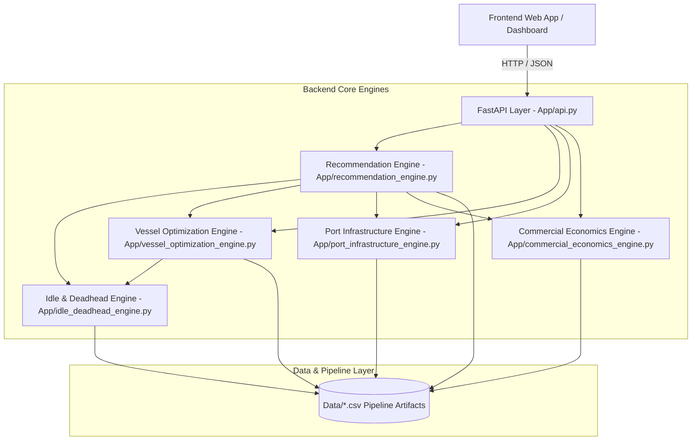
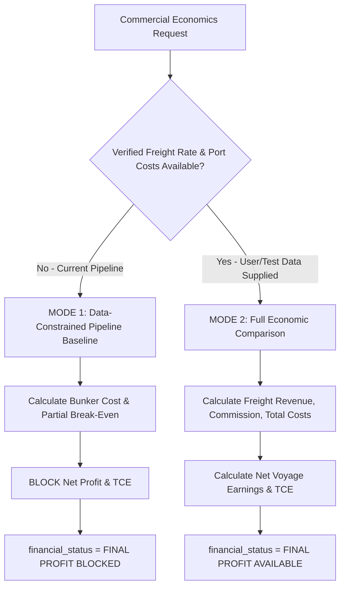

# SAIL Backend — Frontend Handoff

> **Document Version:** 2.0.0  
> **Last Updated:** August 2026  
> **Target Audience:** Frontend Development Team & Full-Stack Integrators  
> **Backend Author:** ML, Analytics, Economics & Backend Engineering Team  
> **System Name:** SAIL — Intelligent Decision-Support Platform for Bulk Cargo Procurement & Vessel Chartering  

---

## Table of Contents

1. [Project Overview](#1-project-overview)
2. [Current Architecture](#2-current-architecture)
3. [Actual Project Folder Structure](#3-actual-project-folder-structure)
4. [Backend Modules Breakdown](#4-backend-modules-breakdown)
5. [API Endpoints Reference](#5-api-endpoints-reference)
6. [Request Schema & Validation Rules](#6-request-schema--validation-rules)
7. [Main Response Structure](#7-main-response-structure)
8. [Frontend Integration Quick Start](#8-frontend-integration-quick-start)
9. [Production-Ready JavaScript Fetch Example](#9-production-ready-javascript-fetch-example)
10. [Error Handling & HTTP Status Codes](#10-error-handling--http-status-codes)
11. [Running Locally & Server Startup](#11-running-locally--server-startup)
12. [CORS Configuration & Network Setup](#12-cors-configuration--network-setup)
13. [Current Validated Scenario & Benchmark Results](#13-current-validated-scenario--benchmark-results)
14. [Backend Implementation Status Table](#14-backend-implementation-status-table)
15. [Data Classification Framework](#15-data-classification-framework)
16. [Known System Limitations](#16-known-system-limitations)
17. [Commercial Data & Financial Guardrails](#17-commercial-data--financial-guardrails)
18. [Test & Validation Status](#18-test--validation-status)
19. [Important Frontend Developer Rules](#19-important-frontend-developer-rules)
20. [Final Handoff Checklist](#20-final-handoff-checklist)

---

## 1. Project Overview

The **SAIL Decision-Support Platform** is an end-to-end analytical and machine-learning engine designed to assist bulk cargo procurement teams and chartering managers in making data-driven vessel chartering decisions.

### Core Objectives:
- **Forecast Baltic Dry indices** (BDI, BPI, BCI, BSI) and assess dry bulk market directional trends.
- **Model voyage economics** (fuel consumption, sea days, port days, VLSFO bunker expenditure, ballast/laden legs).
- **Evaluate vessel-type optimization** across standard bulker classes (Panamax, Capesize, Supramax, Handysize).
- **Enforce port & berth infrastructure constraints** (LOA, beam, draft, DWT, handling rates, turnaround times).
- **Analyze market-entry timing & contract durations** (1, 2, 3, 6-month windows) using multi-criteria strategy scoring.
- **Provide idle & deadhead decision support** to minimize ballast waste and evaluate positioning risks.
- **Deliver transparent commercial economics** under strict data-integrity guardrails that prevent false financial projections.

> **CRITICAL DISCLAIMER:**  
> All outputs produced by this backend are **DECISION-SUPPORT ONLY**. They do not constitute guaranteed commercial profitability. The engine explicitly tracks data gaps and protects users from unverified financial assumptions.

---

## 2. Current Architecture

The backend is built around a decoupled architecture where pure Python analytical decision engines operate completely independently of the presentation and API layer.



### Key Architectural Principles:
1. **Engine Independence:** All engines (`recommendation_engine.py`, `idle_deadhead_engine.py`, `vessel_optimization_engine.py`, `port_infrastructure_engine.py`, `commercial_economics_engine.py`) have zero dependency on FastAPI and can run in batch scripts, Jupyter notebooks, or background workers.
2. **Graceful Degradation:** Optional engines are imported safely. If one engine encounters missing runtime data, the primary recommendation continues to function with explicit `"UNAVAILABLE"` status flags rather than crashing.
3. **No Silent Defaults:** Missing inputs (e.g. unknown port dimensions or unverified freight rates) are never fabricated or defaulted to zero. They remain explicitly classified as `"NOT YET SUPPLIED"`, `"UNKNOWN"`, or `"UNAVAILABLE"`.

---

## 3. Actual Project Folder Structure

The repository structure verified directly from the current codebase:

```text
SIH Backend/
├── App/
│   ├── api.py                            # FastAPI REST API, routing, CORS, Pydantic schemas
│   ├── commercial_economics_engine.py    # Mode 1/Mode 2 charter vs. procurement economics
│   ├── idle_deadhead_engine.py           # Deadhead, idle cost & positioning risk signals
│   ├── port_infrastructure_engine.py     # Port constraint limits (LOA/Beam/Draft/Turnaround)
│   ├── recommendation_engine.py          # Primary orchestrator & scenario strategy engine
│   └── vessel_optimization_engine.py     # Multi-vessel screening, ranking & multi-voyage
├── Data/
│   ├── STEP6B_FINAL_RANDOM_FOREST_FORECAST.csv
│   ├── STEP7B_MONTHLY_BUNKER_PRICE_DATA.csv
│   ├── STEP7E_UNCTAD_DWT_CAPACITY_DATA.csv
│   ├── STEP8C_FORECAST_BUNKER_TIMELINE.csv
│   ├── STEP8D_EXTERNAL_SCENARIO_PARAMETER_MATRIX.csv
│   ├── STEP8D_EXTERNAL_SCENARIO_PARAMETER_SOURCING.csv
│   ├── STEP8E_VESSEL_FEASIBILITY.csv
│   ├── STEP8E_VOYAGE_ECONOMICS_SCENARIO.csv
│   ├── STEP8F_COMMERCIAL_RATE_COST_INPUTS.csv
│   ├── STEP8F_RATE_COVERAGE_AUDIT.csv
│   ├── STEP8G_BREAK_EVEN_FREIGHT.csv
│   ├── STEP8G_PARTIAL_VOYAGE_ECONOMICS.csv
│   ├── STEP8H_MARKET_ENTRY_SIGNAL.csv
│   ├── STEP8H_VESSEL_CHARTER_DECISION.csv
│   ├── STEP8H_VESSEL_RANKING.csv
│   ├── STEP8I_MULTI_SCENARIO_DECISION.csv
│   ├── STEP8I_VESSEL_ROUTE_RANKING.csv
│   ├── STEP8J_CHARTER_WINDOWS.csv
│   ├── STEP8J_CONTRACT_STRATEGY.csv
│   ├── STEP8K_MONTHLY_RISK_SENSITIVITY.csv
│   ├── STEP8K_RISK_MATRIX.csv
│   ├── STEP8K_STRESS_SCENARIOS.csv
│   ├── STEP8L_EXECUTIVE_SUMMARY.csv
│   └── STEP8L_FINAL_SAIL_RECOMMENDATION.csv
├── Models/                               # ML model artifacts
├── Outputs/                              # Exported run artifacts & reports
└── SAIL_BACKEND_HANDOFF.md               # Frontend integration handoff specification
```

---

## 4. Backend Modules Breakdown

The backend contains **11 completed modules**:

### 1. Freight Forecasting / ML
- **Source:** `STEP6B_FINAL_RANDOM_FOREST_FORECAST.csv`
- **Functionality:** Provides 12-month forward predictive trajectory for Baltic Dry indices (BDI, BPI, BCI, BSI) and bunker prices using ensemble Random Forest regressors with historical macroeconomic, commodity, and fleet supply features.

### 2. Voyage Economics
- **Source:** `STEP8E_VOYAGE_ECONOMICS_SCENARIO.csv`, `STEP8G_PARTIAL_VOYAGE_ECONOMICS.csv`
- **Functionality:** Computes distance (nm), sea days (laden/ballast), port days, daily fuel consumption (tpd), total fuel burn, and VLSFO bunker expenditure. Calculates Partial Voyage Cost and Bunker Break-Even ($/mt).

### 3. Market-Entry Timing
- **Source:** `STEP8H_MARKET_ENTRY_SIGNAL.csv`, `STEP8H_VESSEL_CHARTER_DECISION.csv`
- **Functionality:** Evaluates month-by-month market momentum, forward index differentials, and bunker volatility to classify market-entry timing (e.g. `FAVORABLE ENTRY SIGNAL`, `WAIT / MONITOR`).

### 4. Contract-Duration Strategy
- **Source:** `STEP8J_CONTRACT_STRATEGY.csv`, `STEP8J_CHARTER_WINDOWS.csv`
- **Functionality:** Compares short-term (1-month), medium-term (2–3 month), and extended (6-month) charter windows. Generates a multi-criteria Strategy Score (0–100) combining freight advantage, bunker cost risk, and contract flexibility.

### 5. Risk / Sensitivity Engine
- **Source:** `STEP8K_MONTHLY_RISK_SENSITIVITY.csv`, `STEP8K_RISK_MATRIX.csv`, `STEP8K_STRESS_SCENARIOS.csv`
- **Functionality:** Performs stress-testing on bunker price volatility (+10% to +30%), voyage delays (+1 to +5 days), and market rate swings. Assigns risk classifications (`LOW`, `MEDIUM`, `HIGH`, `VERY HIGH`).

### 6. Idle / Deadhead Decision Support
- **Source:** `App/idle_deadhead_engine.py`
- **Functionality:** Calculates deadhead distance and ballast fuel expenditure. Evaluates monthly positioning risk (`LOWER IDLE RISK`, `MODERATE`, `HIGH`). Provides positioning recommendations without fabricating unsupplied alternative routes or revenue.

### 7. Vessel-Type Optimization
- **Source:** `App/vessel_optimization_engine.py`
- **Functionality:** Screens candidate bulkers (Panamax, Capesize, Supramax, Handysize) against route cargo parcel size and port physical limits. Ranks feasible candidates based on composite operational, economic, and risk scores.

### 8. Multi-Voyage Framework
- **Source:** `App/vessel_optimization_engine.py` (multi-voyage structure)
- **Functionality:** Computes annual voyage cycles, total annual lifting capacity, annual fuel requirement, and multi-voyage duration comparisons when voyage scenarios are provided.

### 9. Port / Infrastructure Constraints
- **Source:** `App/port_infrastructure_engine.py`
- **Functionality:** Evaluates LOA, beam, draft, DWT, loading/discharge rates, berth counts, and port turnaround times at origin and destination ports. Explicitly flags missing port parameters as `NOT YET SUPPLIED`.

### 10. Commercial / Charter-Procurement Economics
- **Source:** `App/commercial_economics_engine.py`
- **Functionality:** Supports **Mode 1** (Data-Constrained Pipeline Baseline) and **Mode 2** (Full Economic Comparison). Evaluates freight revenue, commissions, total voyage costs, net voyage earnings, Time Charter Equivalent (TCE), and commercial break-even when commercial rate inputs are supplied.

### 11. FastAPI Layer
- **Source:** `App/api.py`
- **Functionality:** High-performance asynchronous REST API with strict Pydantic v2 input validation, CORS middleware, standardized error envelopes, interactive OpenAPI docs (`/docs`), and health monitoring.

---

## 5. API Endpoints Reference

| Method | Endpoint | Description | Request Body | Response Status |
|---|---|---|---|---|
| `GET` | `/` | API welcome, version info, endpoint directory | None | `200 OK` |
| `GET` | `/health` | Liveness and health check | None | `200 OK` |
| `GET` | `/scenarios` | List supported origin/destination/cargo scenarios | None | `200 OK` |
| `POST` | `/api/recommendation` | **Primary Decision-Support Endpoint** (Integrated) | `RecommendationRequest` | `200`, `400`, `422`, `500` |
| `POST` | `/api/vessel-optimization` | Detailed vessel screening & ranking report | `RecommendationRequest` | `200`, `400`, `422`, `500` |
| `POST` | `/api/port-feasibility` | Dedicated port & infrastructure screening report | `RecommendationRequest` | `200`, `400`, `422`, `500` |
| `POST` | `/api/commercial-economics` | Commercial charter vs. procurement comparison | `RecommendationRequest` | `200`, `400`, `422`, `500` |

---

## 6. Request Schema & Validation Rules

All `POST` endpoints accept the exact same Pydantic schema (`RecommendationRequest`):

```json
{
  "cargo_type": "Coal",
  "cargo_tonnes": 80000,
  "origin": "Gladstone, Australia",
  "destination": "Dhamra, India",
  "contract_duration_months": 1
}
```

### Field Specifications & Validation Constraints:

| Field Name | Type | Constraints | Description | Valid Example |
|---|---|---|---|---|
| `cargo_type` | `string` | 1–100 chars, stripped of whitespace | Cargo classification | `"Coal"` |
| `cargo_tonnes` | `float` | `gt: 0`, `le: 500000` | Cargo parcel size in metric tonnes | `80000` |
| `origin` | `string` | 2–200 chars, stripped of whitespace | Loading port / terminal | `"Gladstone, Australia"` |
| `destination` | `string` | 2–200 chars, stripped of whitespace | Discharge port / terminal | `"Dhamra, India"` |
| `contract_duration_months` | `integer` | `ge: 1`, `le: 24` | Requested contract window in months | `1` |

---

## 7. Main Response Structure

Calling `POST /api/recommendation` returns the complete integrated decision object:

```json
{
  "status": "OK",
  "scenario_id": "GLADSTONE_DHAMRA_COAL",
  "inputs": {
    "cargo_type": "coal",
    "cargo_tonnes": 80000.0,
    "origin": "gladstone, australia",
    "destination": "dhamra, india",
    "contract_duration_months": 1
  },
  "recommended_vessel": "Panamax",
  "port_feasibility": "PASS",
  "best_month": "2025-12",
  "best_month_strategy_score": 100.0,
  "best_month_market_signal": "FAVORABLE ENTRY SIGNAL",
  "best_month_bunker_risk": "LOW",
  "selected_window": {
    "start": "2025-12",
    "end": "2025-12",
    "duration_months": 1,
    "duration_class": "SHORT-TERM",
    "strategy_score": 100.0
  },
  "break_even": {
    "average_usd_per_mt": 6.91,
    "maximum_stressed_usd_per_mt": 9.47
  },
  "risk": {
    "selected_window_risk": "LOW"
  },
  "commercial_data": {
    "rate_available": false,
    "final_profit_available": false,
    "final_tce_available": false,
    "financial_status": "FINAL PROFIT BLOCKED"
  },
  "recommendation": "CONSIDER PANAMAX CONTRACTING",
  "recommendation_reason": "Strategy model indicates favorable short-term entry for Panamax on Gladstone -> Dhamra in 2025-12 with strategy score 100.0/100 and bunker risk LOW.",
  "data_quality": "DECISION SUPPORT",
  "cargo_status": "MATCHED",
  "cargo_note": "Cargo quantity matches the current validated scenario.",
  "idle_deadhead": {
    "module_status": "IDLE / DEADHEAD DECISION SUPPORT",
    "selected_month": "2025-12",
    "selected_month_idle_risk_signal": "LOWER IDLE RISK",
    "selected_month_positioning_recommendation": "FAVORABLE POSITIONING -- standard ballast repositioning recommended",
    "selected_month_risk_class": "LOW",
    "selected_month_bunker_risk": "LOW",
    "selected_month_strategy_class": "STRONG ENTRY ENVIRONMENT",
    "selected_month_strategy_score": 100.0,
    "alternative_employment_status": "NOT YET SUPPLIED -- no alternative employment scenarios provided",
    "data_status": {
      "alternative_ports": "NOT YET SUPPLIED",
      "alternative_employment_revenue": "NOT YET SUPPLIED",
      "idle_daily_cost": "NOT YET SUPPLIED"
    },
    "signal_note": "Idle/deadhead signals are DECISION-SUPPORT only. They are NOT predictions of exact idle days."
  },
  "vessel_optimization": {
    "status": "OK",
    "scenario_id": "GLADSTONE_DHAMRA_COAL",
    "inputs": {
      "cargo_type": "coal",
      "cargo_tonnes": 80000.0,
      "origin": "gladstone, australia",
      "destination": "dhamra, india",
      "contract_duration_months": 1
    },
    "candidate_vessels": [
      {
        "vessel_type": "Panamax",
        "dwt_tonnes": 75000.0,
        "is_feasible": true,
        "screening_status": "FEASIBLE"
      },
      {
        "vessel_type": "Capesize",
        "dwt_tonnes": 180000.0,
        "is_feasible": false,
        "screening_status": "INFEASIBLE_PORT_DRAFT"
      }
    ],
    "ranked_vessels": [
      {
        "rank": 1,
        "vessel_type": "Panamax",
        "composite_score": 100.0,
        "port_feasible": true,
        "recommendation": "PRIMARY CANDIDATE"
      },
      {
        "rank": 2,
        "vessel_type": "Capesize",
        "composite_score": 0.0,
        "port_feasible": false,
        "recommendation": "BENCHMARK ONLY -- FAILS DHAMRA DRAFT SCREEN"
      }
    ],
    "recommended_vessel": "Panamax",
    "recommendation_reason": "Panamax is the primary feasible vessel meeting all port and cargo constraints.",
    "economic_profiles": { ... },
    "duration_comparison": { ... },
    "multi_voyage": { ... },
    "integrity_checks": { ... },
    "limitations": [ ... ]
  },
  "port_infrastructure": {
    "voyage_route": "Gladstone, Australia -> Dhamra, India",
    "vessel_type": "Panamax",
    "cargo_tonnes": 80000.0,
    "voyage_port_status": "FEASIBLE",
    "is_voyage_feasible": true,
    "origin_feasibility": {
      "port_name": "Gladstone, Australia",
      "port_status": "FEASIBLE_WITH_DATA_GAPS",
      "missing_constraints": ["max_loa_m", "max_beam_m", "max_draft_m", "max_dwt_tonnes", "cargo_handling_rate_tpd"]
    },
    "destination_feasibility": {
      "port_name": "Dhamra, India",
      "port_status": "FEASIBLE",
      "checks": {
        "loa_check": { "vessel_value": 225.0, "port_limit": 300.0, "status": "PASS" },
        "beam_check": { "vessel_value": 32.26, "port_limit": 50.0, "status": "PASS" },
        "draft_check": { "vessel_value": 14.2, "port_limit": 17.5, "status": "PASS" }
      }
    },
    "voyage_turnaround": {
      "estimated_total_turnaround_days": 3.0,
      "data_class": "SCENARIO ASSUMPTION"
    },
    "missing_data": [ ... ],
    "integrity_notes": [ ... ]
  },
  "commercial_economics": {
    "status": "OK",
    "mode": "MODE 1: DATA-CONSTRAINED PIPELINE BASELINE",
    "scenario_id": "GLADSTONE_DHAMRA_COAL",
    "financial_status": "FINAL PROFIT BLOCKED",
    "commercial_rate_available": false,
    "final_profit_available": false,
    "final_tce_available": false,
    "comparison": { ... },
    "data_gaps": [
      "Commercial freight rate ($/mt) is UNAVAILABLE",
      "Complete port charges ($) are UNAVAILABLE",
      "Other voyage costs ($) are UNAVAILABLE"
    ],
    "limitations": [ ... ]
  },
  "api_version": "1.0.0",
  "generated_at": "2026-08-31T01:50:50.000000+00:00",
  "disclaimer": "This output is DECISION SUPPORT only. It is NOT a guarantee of commercial profitability. Commercial freight rates and full voyage costs are currently unavailable in this model. Final contract decisions require complete cost data and professional commercial judgement."
}
```

---

## 8. Frontend Integration Quick Start

Follow these 12 practical steps to integrate your UI with the backend:

- **A. Start Backend:** Open a terminal in the backend directory and launch Uvicorn (see [Section 11](#11-running-locally--server-startup)).
- **B. Open Swagger:** Verify endpoints in your browser at `http://localhost:8000/docs`.
- **C. Fetch `/scenarios`:** Populate your UI dropdowns (origin, destination, cargo, default vessel) dynamically using `GET /scenarios`.
- **D. Send `POST /api/recommendation`:** Submit user selections matching the request schema.
- **E. Read `recommended_vessel`:** Display the top recommended vessel candidate (e.g. `Panamax`).
- **F. Read `best_month`:** Display the optimal market-entry month (e.g. `2025-12`) along with `best_month_strategy_score`.
- **G. Read `recommendation`:** Display the executive recommendation banner and `recommendation_reason`.
- **H. Read `idle_deadhead`:** Render the deadhead status, positioning recommendation, and idle-risk badge (`LOWER IDLE RISK`).
- **I. Read `vessel_optimization`:** Render the candidate vessel comparison table and ranking breakdown.
- **J. Read `port_infrastructure`:** Display berth/draft clearance gauges for Dhamra and data-gap notices for Gladstone.
- **K. Read `commercial_economics`:** Display partial bunker break-even ($6.91/mt) and comparison metrics.
- **L. Respect Financial Status:** Check `commercial_data.financial_status`. If it is `"FINAL PROFIT BLOCKED"`, display a locked or disabled badge. **NEVER display final profit or TCE as $0.00.**

---

## 9. Production-Ready JavaScript Fetch Example

```javascript
/**
 * SAIL Backend Integration Client
 */
const BACKEND_BASE_URL = "http://localhost:8000";

async function fetchSailRecommendation(payload) {
  try {
    const response = await fetch(`${BACKEND_BASE_URL}/api/recommendation`, {
      method: "POST",
      headers: {
        "Content-Type": "application/json",
        "Accept": "application/json"
      },
      body: JSON.stringify(payload)
    });

    // Handle standard HTTP error statuses
    if (!response.ok) {
      const errorData = await response.json();
      
      if (response.status === 422) {
        // Pydantic Schema Validation Error
        console.error("Validation Error (422):", errorData.detail);
        throw new Error(`Input validation failed: ${errorData.detail[0]?.msg || "Invalid format"}`);
      } else if (response.status === 400) {
        // Business Logic Error (e.g. UNSUPPORTED_ROUTE, DURATION_NOT_SUPPORTED)
        console.error(`Business Error (${errorData.error_code}):`, errorData.message);
        throw new Error(`${errorData.message} (${errorData.error_code})`);
      } else if (response.status === 500) {
        // Server or Data File Error
        console.error("Server Error (500):", errorData.message);
        throw new Error("Backend service encountered an error. Please verify backend Data/ files.");
      } else {
        throw new Error(`Unexpected error HTTP ${response.status}`);
      }
    }

    const data = await response.json();
    return data;

  } catch (err) {
    console.error("Failed to fetch recommendation:", err);
    throw err;
  }
}

// Example Usage:
(async () => {
  const requestPayload = {
    cargo_type: "Coal",
    cargo_tonnes: 80000,
    origin: "Gladstone, Australia",
    destination: "Dhamra, India",
    contract_duration_months: 1
  };

  try {
    const result = await fetchSailRecommendation(requestPayload);
    
    console.log("=== Recommendation Received ===");
    console.log("Recommended Vessel:", result.recommended_vessel);
    console.log("Optimal Month:", result.best_month);
    console.log("Strategy Score:", result.best_month_strategy_score);
    console.log("Idle Risk Signal:", result.idle_deadhead.selected_month_idle_risk_signal);
    console.log("Financial Status:", result.commercial_data.financial_status);
    
    if (result.commercial_data.financial_status === "FINAL PROFIT BLOCKED") {
      console.warn("Notice: Commercial freight rate unavailable. Net profit is protected/blocked.");
    }
  } catch (error) {
    // Render UI error alert
  }
})();
```

---

## 10. Error Handling & HTTP Status Codes

The API returns structured, predictable error envelopes across all standard failure scenarios:

### 1. `HTTP 200 OK`
Request processed successfully. Returns the full enriched response payload.

### 2. `HTTP 400 Bad Request`
Triggered by unsupported analytical routes or unsupported contract durations.

```json
{
  "status": "ERROR",
  "error_code": "UNSUPPORTED_ROUTE",
  "message": "The requested origin / destination / cargo combination has no validated analytical scenario. Call GET /scenarios for the list of supported routes.",
  "detail": "UNSUPPORTED_ROUTE: No validated scenario is available for Newcastle, Australia -> Dhamra, India (Coal).",
  "api_version": "1.0.0"
}
```

```json
{
  "status": "ERROR",
  "error_code": "DURATION_NOT_SUPPORTED",
  "message": "Contract duration of 5 month(s) is not modelled for this scenario. Available durations: [1, 2, 3, 6] months.",
  "detail": "The strategy model was built for specific durations only. Re-submit with one of the available durations listed above.",
  "api_version": "1.0.0"
}
```

### 3. `HTTP 422 Unprocessable Entity`
Triggered by Pydantic schema validation failures (e.g. negative cargo tonnage, zero duration, missing fields).

```json
{
  "detail": [
    {
      "type": "greater_than",
      "loc": ["body", "cargo_tonnes"],
      "msg": "Input should be greater than 0",
      "input": -100,
      "ctx": { "gt": 0.0 }
    }
  ]
}
```

### 4. `HTTP 500 Internal Server Error`
Triggered by missing CSV pipeline files in `Data/` or unhandled exceptions.

```json
{
  "status": "ERROR",
  "error_code": "DATA_FILE_MISSING",
  "message": "A required backend data file is missing. Ensure all pipeline CSV outputs are present in the Data/ folder.",
  "detail": "Required backend data file not found: .../Data/STEP8J_CONTRACT_STRATEGY.csv",
  "api_version": "1.0.0"
}
```

---

## 11. Running Locally & Server Startup

### Prerequisites:
- Python 3.10+ (tested on Python 3.11, 3.12, 3.14)
- Packages: `fastapi`, `uvicorn`, `pandas`, `pydantic`

### Launch Command:
From the root directory `SIH Backend`:

```powershell
cd App
python -m uvicorn api:app --host 0.0.0.0 --port 8000 --reload
```

### Verifying Startup:
1. **Root Status:** [http://localhost:8000/](http://localhost:8000/)
2. **Health Check:** [http://localhost:8000/health](http://localhost:8000/health)
3. **Interactive Swagger Docs:** [http://localhost:8000/docs](http://localhost:8000/docs)
4. **ReDoc Documentation:** [http://localhost:8000/redoc](http://localhost:8000/redoc)

---

## 12. CORS Configuration & Network Setup

### Allowed Development Origins:
Configured in `App/api.py` via `CORSMiddleware`:
- `http://localhost:3000` (React / Next.js)
- `http://localhost:5173` (Vite / Svelte / Vue)
- `http://localhost:4200` (Angular)
- `http://localhost:8080` (Vue CLI / static servers)
- `http://127.0.0.1:3000`, `5173`, `4200`, `8080`

### Important Local-Network & Multi-Machine Note:
- `localhost` and `127.0.0.1` refer strictly to the **same physical machine**.
- If the frontend and backend run on different laptops/machines on the same Wi-Fi/LAN:
  1. The frontend must point to the backend computer's LAN IP (e.g. `http://192.168.1.45:8000`).
  2. The frontend machine's origin (e.g. `http://192.168.1.50:5173`) must be added to `CORS_ORIGINS` in `api.py`.
  3. Ensure Windows Firewall permits incoming traffic on TCP port `8000`.

---

## 13. Current Validated Scenario & Benchmark Results

The primary benchmark scenario validated across the end-to-end analytical pipeline:

| Parameter | Value | Provenance / Data Class |
|---|---|---|
| **Origin** | `Gladstone, Australia` | Scenario Input |
| **Destination** | `Dhamra, India` | Scenario Input |
| **Cargo Type** | `Coal` | Scenario Input |
| **Cargo Parcel** | `80,000 tonnes` | Validated Pipeline Scenario |
| **Recommended Vessel** | `Panamax` | Feasible & Highest Operational Score |
| **Model Best Month** | `2025-12` | Highest Strategy Score |
| **Strategy Score** | `100.0 / 100.0` | Multi-Criteria Model Output |
| **Market Entry Signal** | `FAVORABLE ENTRY SIGNAL` | 8H Decision Signal |
| **Bunker Risk** | `LOW` | 8K Sensitivity Evaluation |
| **Idle / Deadhead Risk** | `LOWER IDLE RISK` | Idle Engine Signal |
| **Positioning Advice** | `FAVORABLE POSITIONING` | Standard Ballast Repositioning |
| **Partial Break-Even** | `$6.91 / mt` | Partial Voyage Economics (Bunker + Commission) |
| **Financial Status** | `FINAL PROFIT BLOCKED` | Commercial Rates Not Yet Supplied |

---

## 14. Backend Implementation Status Table

| SIH Backend Requirement | Status | Technical Implementation Notes |
|---|---|---|
| **Freight Forecasting / ML** | ✅ **DONE** | 12-month forward predictive trajectory for BDI/BPI/BCI/BSI via Random Forest |
| **Voyage Economics** | ✅ **DONE** | Distance, sea/port days, fuel burn, VLSFO bunker expenditure, and $/mt break-even |
| **Market-Entry Timing** | ✅ **DONE** | Decision support based on forward index momentum and bunker volatility |
| **Contract-Duration Strategy** | ✅ **DONE** | Multi-window strategy scoring (1, 2, 3, 6 months) with duration comparison |
| **Risk / Sensitivity Warnings** | ✅ **DONE** | Stress matrix (+10%–30% bunker, +1–5 day delays), risk classification badges |
| **Idle / Deadhead Decision Support**| ✅ **DONE** | Deadhead calculations, positioning risk classification (`LOWER IDLE RISK`) |
| **Vessel-Type Optimization** | ✅ **DONE** | Multi-vessel screening (Panamax, Capesize, Supramax, Handysize) & ranking |
| **Port / Infrastructure Constraints**| ✅ **DONE** | Dual-port screening (LOA, beam, draft, DWT, handling rates, turnaround) |
| **Charter / Procurement Economics** | ✅ **DONE** | Dual-mode engine (Mode 1 constrained pipeline / Mode 2 full comparison) |
| **Multi-Voyage Framework** | ✅ **DONE** | Annual voyage cycle, annual liftings, and cumulative bunker calculations |
| **FastAPI REST API** | ✅ **DONE** | Fully documented OpenAPI schemas, CORS, standardized error envelopes |
| **Frontend Integration** | 🔄 **IN PROGRESS** | Integrating frontend UI with validated backend endpoints |

---

## 15. Data Classification Framework

To maintain scientific and commercial integrity, every data point surfaced by the backend is classified into one of the following strict categories:

1. **`VERIFIED PROJECT DATA`**: Raw data loaded directly from verified analytical pipeline CSV outputs.
2. **`EXTERNAL REFERENCE`**: Published port tariffs, terminal specifications, or Baltic route dimensions (e.g. Dhamra port limits).
3. **`SCENARIO ASSUMPTION`**: Explicitly stated operational assumptions (e.g. 1.5 port days at loading, 13.0 knots ballast speed).
4. **`USER/PROJECT SUPPLIED TEST DATA`**: Parameters supplied dynamically by the frontend/user at runtime.
5. **`CALCULATED VALUE`**: Mathematically derived using explicit formulas (e.g. sea days $= \text{Distance} / (\text{Speed} \times 24)$).
6. **`UNKNOWN` / `NOT YET SUPPLIED`**: Missing data that has not been supplied. **The backend NEVER substitutes defaults.**
7. **`UNAVAILABLE`**: Blocked metrics due to absent upstream prerequisites (e.g. final net profit when commercial freight rate is missing).

---

## 16. Known System Limitations

1. **Verified C18 & P9 Commercial Freight Rates:** Not currently available in the dataset.
2. **Complete Port Dues & Tariffs:** Port charges ($) are not yet supplied.
3. **Other Voyage Costs:** Canal dues, agency fees, towage, and insurance are not yet supplied.
4. **Final Profit / Net TCE:** Intentionally **BLOCKED** for the pipeline baseline scenario to prevent misleading figures.
5. **Gladstone Physical Constraints:** Physical LOA, beam, draft, DWT, and loading rates remain `NOT YET SUPPLIED`.
6. **Live Port Congestion & Queues:** Dynamic waiting time data is unavailable; static turnaround assumptions are used.
7. **Alternative Employment Routes:** Real-world alternative discharge employment opportunities are not currently supplied.
8. **Multi-Voyage Scenarios:** Annual multi-voyage modeling requires caller-provided voyage schedules.
9. **Benchmark Vessel Dimensions:** Vessel dimensions (e.g. 180k DWT Capesize benchmark) represent specific references, not all vessels in that class.
10. **Baltic Indices Interpretation:** BPI and BCI are market sentiment indices and are **NEVER** converted directly to $/mt freight revenue.

---

## 17. Commercial Data & Financial Guardrails

The Commercial Economics engine operates in two distinct modes:



### UI Implementation Rules for Financial Status:
- When `commercial_data.financial_status === "FINAL PROFIT BLOCKED"`:
  - Display the partial bunker break-even ($6.91/mt).
  - Display a locked badge: `"Commercial Rate Input Required for Full Profit Calculation"`.
  - **Do NOT render Net Profit or TCE as `$0.00` or `0.00 $/day`.** Display `"UNAVAILABLE"` or `"—"`.

---

## 18. Test & Validation Status

The backend suite has undergone complete functional and edge-case verification:

| Test Case | Scenario / Payload | Expected Code | Verified Result |
|---|---|---|---|
| **Root Endpoint** | `GET /` | `200 OK` | `200 OK` — API metadata and endpoint listing returned |
| **Health Check** | `GET /health` | `200 OK` | `200 OK` — `status: HEALTHY` |
| **Scenarios List** | `GET /scenarios` | `200 OK` | `200 OK` — 1 validated scenario returned |
| **Main Recommendation** | `POST /api/recommendation` (Valid) | `200 OK` | `200 OK` — Panamax, 2025-12, score 100, LOWER IDLE RISK |
| **Vessel Optimization** | `POST /api/vessel-optimization` | `200 OK` | `200 OK` — Candidate screening & rankings returned |
| **Port Feasibility** | `POST /api/port-feasibility` | `200 OK` | `200 OK` — Dhamra clearance PASS, Gladstone gaps identified |
| **Commercial Economics** | `POST /api/commercial-economics` | `200 OK` | `200 OK` — Mode 1 executed, financial guardrails active |
| **Unsupported Route** | Origin: `"Newcastle, Australia"` | `400 Bad Request` | `400 Bad Request` — `UNSUPPORTED_ROUTE` |
| **Unsupported Duration** | Duration: `5 months` | `400 Bad Request` | `400 Bad Request` — `DURATION_NOT_SUPPORTED` |
| **Negative Cargo Input** | Cargo: `-100 tonnes` | `422 Unprocessable` | `422 Unprocessable Entity` — Pydantic schema validation error |

---

## 19. Important Frontend Developer Rules

To prevent misleading visualizations during live jury evaluation:

1. ❌ **DO NOT recalculate recommendation logic in JavaScript:** Always use the values returned by the backend.
2. ❌ **DO NOT convert BPI or BCI to $/mt freight revenue:** They are market indices, not freight dollars.
3. ❌ **DO NOT hide `"UNKNOWN"` or `"NOT YET SUPPLIED"` data:** Display data gaps transparently with informational tooltips.
4. ❌ **DO NOT display blocked financial values as zero (`$0.00`):** Render them as `"N/A"`, `"UNAVAILABLE"`, or with a lock icon.
5. ❌ **DO NOT label outputs as "Guaranteed Profit":** Use the term **"Decision Support"**.
6. ❌ **DO NOT claim all Capesize vessels are universally infeasible:** Clarify that the *180k DWT benchmark vessel* fails Dhamra's 17.5m draft screen.
7. ❌ **DO NOT assume missing port data implies a PASS:** Missing constraints must be labeled `NOT YET SUPPLIED`.
8. ❌ **DO NOT hard-code API response data in the UI:** Fetch dynamic data from the backend.

---

## 20. Final Handoff Checklist

- [x] Backend starts cleanly via `python -m uvicorn api:app --host 0.0.0.0 --port 8000 --reload`
- [x] Swagger documentation is accessible at `http://localhost:8000/docs`
- [x] `GET /health` returns `200 OK` and `HEALTHY` status
- [x] `GET /scenarios` returns supported scenario configurations
- [x] `POST /api/recommendation` returns all 22 integrated decision keys
- [x] `POST /api/vessel-optimization` returns vessel candidate rankings and screening
- [x] `POST /api/port-feasibility` returns dual-port infrastructure clearance checks
- [x] `POST /api/commercial-economics` returns Mode 1 / Mode 2 economic evaluations
- [x] CORS middleware is configured for standard frontend development ports (3000, 5173, 4200, 8080)
- [x] JavaScript fetch client example is tested and documented
- [x] Response schemas and field definitions are fully documented
- [x] Standard error responses (`400`, `422`, `500`) are documented with JSON examples
- [x] Commercial financial guardrails (`FINAL PROFIT BLOCKED`) are clearly explained
- [x] Current data limitations and data classification framework are documented
